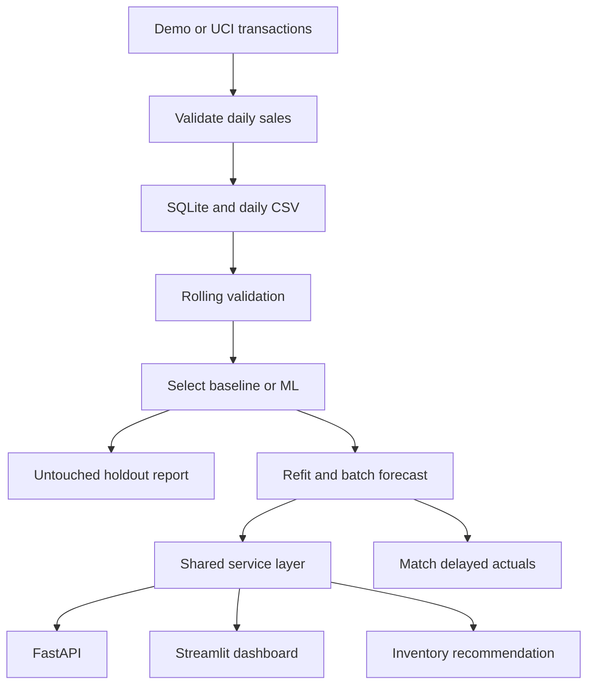

# Stockwise — Retail Forecast & Inventory Planner

An end-to-end portfolio project that forecasts daily product sales and turns forecasts into explainable replenishment recommendations.

**Python · SQL · scikit-learn · FastAPI · Streamlit · Docker · GitHub Actions**

[คู่มือภาษาไทย](docs/QUICKSTART_TH.md) · [Methodology](docs/METHODOLOGY.md) · [Model card](docs/MODEL_CARD.md) · [GitHub publishing](docs/GITHUB.md)

## Business problem

A store needs to decide how much of each product to order before the next replenishment arrives. This project predicts 1–28 days of sales, accounts for stock already held or ordered, and recommends order quantities under explicit lead-time, review-period, safety-stock and pack-size assumptions.

**Scope:** an executable portfolio MVP and historical replay, not an autonomous purchasing system. The default demo is synthetic and requires no credentials or downloads. A separate importer supports the real UCI Online Retail / Online Retail II workbook.

## Quick start

Python 3.12 is the tested environment. Run commands from the repository root.

```bash
python -m venv .venv
# macOS / Linux:
source .venv/bin/activate
# Windows PowerShell instead:
# .venv\Scripts\Activate.ps1

python -m pip install -r requirements-lock.txt
python -m pip install --no-deps -e .
python -m retail.cli demo
python -m streamlit run app/dashboard.py
```

Open http://localhost:8501. In a second terminal with the same environment activated:

```bash
python -m uvicorn retail.api:app --host 127.0.0.1 --port 8000
```

API documentation: http://localhost:8000/docs.

Alternatively, with Docker and Docker Compose installed:

```bash
docker compose up --build
```

The pipeline service generates data, evaluates and trains before API and dashboard start. The named volume keeps generated artifacts. This trains a demo on startup; it is not a scheduled production retraining service. The Python workflow was executed in the development environment; Docker configuration is supplied but was not executed there because Docker was unavailable.

## What is included

- Strict daily-sales validation, explicit zero-fill policy for the UCI transaction importer, and SQLite analytical storage.
- A weekly seasonal-naive baseline and a pooled direct multi-horizon histogram gradient boosting model with Poisson loss.
- Two 28-day rolling validation windows for selection, followed by a separate 28-day holdout.
- Per-SKU and per-horizon error reports, signed forecast bias, and an actual-versus-forecast plot.
- Inventory recommendations with on-hand stock, incoming stock, backorders, safety days, minimum order and pack size.
- A one-cycle inventory simulation comparing both models under identical assumptions and multiple shortage penalties.
- REST API, bilingual dashboard, structured request latency logs, and delayed-actuals monitoring.
- Unit/integration tests, pinned tested dependencies, Docker Compose and GitHub Actions CI.

The dashboard and REST API share the same service layer and precomputed forecast artifacts. The dashboard does not require the API server to run. No model deserialization occurs in either serving process.

## Architecture



## Reproducible demo results

Default seed: 42; 20 synthetic products, 420 days, 8,400 daily rows. These numbers measure the **synthetic demo only** and do not establish real-world accuracy.

| Split | Model | MAE (units) | WAPE |
|---|---|---:|---:|
| Validation | Seasonal naive | 9.590 | 18.20% |
| Validation | Gradient boosting | 8.653 | 16.42% |
| Holdout | Seasonal naive | 9.602 | 18.12% |
| Holdout | Gradient boosting | 8.602 | 16.24% |

The model is selected on validation MAE, not holdout performance. ML holdout bias is approximately **−6.10 units/day/product**: this underforecasting is a meaningful limitation even though absolute error improves. Hyperparameters are fixed; the holdout was not used for tuning.


Machine-readable evidence is in `reports/metrics.json`, `metrics_by_sku.csv`, `metrics_by_horizon.csv` and `backtest_predictions.csv`. Re-running the pipeline overwrites reports with the current dataset; this static table describes only the original synthetic run.

## Use real sales data

### Your daily CSV

Required columns: `date,sku,quantity`. Each SKU must have the same complete daily calendar, unique date/SKU pairs, nonnegative finite quantities, and at least 180 days. Use up to 255 products. Units may be fractional. Rows are observed sales, not necessarily unconstrained demand.

```bash
python -m retail.cli train --csv path/to/daily_sales.csv
```

Missing days are rejected instead of silently changed to zero. Fill zero-sale days only when that interpretation is defensible. Restart the API after rebuilding artifacts; the dashboard loads current artifacts on rerun. Do not rebuild the same directory while it is serving traffic.

### UCI Online Retail II

Download and unzip the official workbook from [UCI](https://archive.ics.uci.edu/dataset/502/online%2Bretail%2Bii), then place it at `data/raw/online_retail_II.xlsx`.

```bash
python -m retail.cli import-uci --input data/raw/online_retail_II.xlsx --top-n 20
python -m retail.cli train --csv data/processed/daily_sales.csv
```

The importer reads all workbook sheets, accepts either `Invoice`/`Price` or `InvoiceNo`/`UnitPrice`, excludes cancellations and nonpositive quantities/prices, aggregates gross positive sales, and selects products by volume in the first 90 days only. It explicitly assumes transaction-free days are zero observed sales; it cannot identify store closures, stockouts, discontinued products or incomplete terminal days. It does not deduplicate identical line items without a reliable line identifier. See the methodology before interpreting results.

Dataset: Chen, D. (2012), *Online Retail II*, UCI Machine Learning Repository, [DOI: 10.24432/C5CG6D](https://doi.org/10.24432/C5CG6D), [CC BY 4.0](https://creativecommons.org/licenses/by/4.0/). This license is separate from the code license. No customer identifiers are required or retained in daily sales output.

## API examples

```bash
curl "http://localhost:8000/forecast/SKU-001?horizon=7"
curl -X POST "http://localhost:8000/inventory/recommend" \
  -H "Content-Type: application/json" \
  -d '{"sku":"SKU-001","on_hand":150,"on_order":50,"lead_days":3,"review_days":7,"safety_days":2,"pack_size":12}'
```

On Windows, use the interactive `/docs` page or `curl.exe` with suitable shell quoting.

| Endpoint | Purpose |
|---|---|
| `GET /health` | Service readiness and data cutoff |
| `GET /products` | Available SKUs |
| `GET /metrics` | Provenance, selected model and evaluation |
| `GET /forecast/{sku}?horizon=7` | 1–28 days of forecasts |
| `POST /inventory/recommend` | Explainable order recommendation |

Unknown products return 404. Invalid horizons and inventory inputs return 422. Protection period (`lead_days + review_days`) cannot exceed 28 days. The service returns the historical forecast origin so old data is not mistaken for a live forecast.

## Monitoring

Forecasts are logged in `artifacts/forecasts.csv`, including origin, horizon, model and data fingerprint. Once actual sales become available:

```bash
python -m retail.cli monitor --actuals path/to/new_actuals.csv
```

The report contains MAE, WAPE, bias and match coverage. It only evaluates matching dates and SKUs; partial coverage is visible. Preserve each forecast vintage before a new pipeline run overwrites it. This is an offline error-monitoring command; automated scheduling, drift alerts and a model registry are future work.

## Tests

```bash
python -m ruff check .
python -m pytest -q
```

Tests cover temporal feature isolation, training-label cutoffs, baseline behavior, nonnegative forecasts, invalid/duplicate inputs, UCI conversion, inventory rounding and arrival timing, REST responses and monitoring alignment. CI also executes the full demo pipeline.

## Repository map

| Path | Responsibility |
|---|---|
| `src/retail/data.py` | Data contracts, UCI conversion and SQL store |
| `src/retail/model.py` | Origin features, training and direct forecasts |
| `src/retail/evaluate.py` | Temporal backtests and inventory scenarios |
| `src/retail/inventory.py` | Order policy and one-cycle simulation |
| `src/retail/pipeline.py` | End-to-end orchestration and reports |
| `src/retail/api.py` | REST API and validation |
| `src/retail/service.py` | Shared serving logic |
| `app/dashboard.py` | Interactive bilingual dashboard |
| `notebooks/01_sales_eda.ipynb` | SQL and sales exploration |
| `tests/` | Automated checks |
| `docs/` | Thai setup, methodology, model card and publishing |

## Improvements to discuss in an interview

1. Add stock availability, promotions, holidays, prices and supplier lead-time distributions.
2. Evaluate intermittent-demand baselines and per-segment model selection.
3. Calibrate forecast uncertainty on independent validation data before promising a service level.
4. Extend one-cycle simulation to a rolling inventory system with scheduled receipts and stockout censoring.
5. Add immutable model releases, scheduled training, authentication and operational alerting before public production use.

## License

Code: MIT. See `LICENSE`. Third-party datasets retain their own licenses. Replace the copyright holder with your preferred name before publishing.
