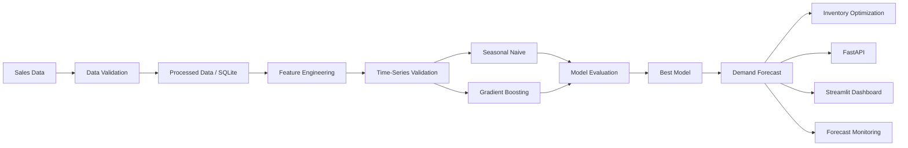
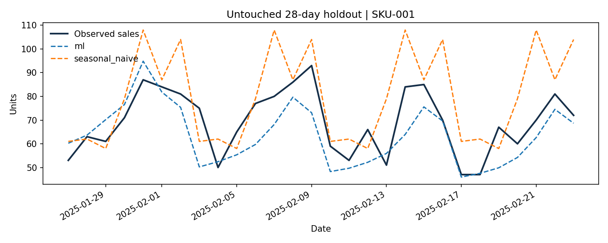

# 📦 Retail Demand Forecasting & Inventory Optimization

> ระบบ Machine Learning แบบ End-to-End สำหรับพยากรณ์ความต้องการสินค้าในธุรกิจค้าปลีก และนำผลการพยากรณ์มาช่วยแนะนำปริมาณสินค้าที่ควรสั่งซื้อ

**Python • Machine Learning • Time Series • FastAPI • Streamlit • SQL • Docker • GitHub Actions**


---

## 🎯 เกี่ยวกับโปรเจกต์

ธุรกิจค้าปลีกต้องบริหารสินค้าคงคลังให้สมดุลระหว่างสองปัญหาหลัก

- 📦 **Overstock** — มีสินค้ามากเกินไป ทำให้ต้นทุนการจัดเก็บสูง
- ⚠️ **Stockout** — สินค้าหมด ทำให้เสียโอกาสในการขาย

โปรเจกต์นี้พัฒนาระบบ **Machine Learning แบบ End-to-End** เพื่อพยากรณ์ยอดขายสินค้าในอนาคต และนำผลการพยากรณ์มาคำนวณปริมาณสินค้าที่ควรสั่งเพิ่ม

Pipeline หลักของระบบ:

```text
Raw Data
   ↓
Data Validation
   ↓
Data Processing
   ↓
Feature Engineering
   ↓
Model Training
   ↓
Time-Series Backtesting
   ↓
Model Evaluation
   ↓
Demand Forecast
   ↓
Inventory Optimization
   ↓
FastAPI
   ↓
Streamlit Dashboard
   ↓
Model Monitoring
```

โปรเจกต์นี้สร้างขึ้นเพื่อแสดงทักษะด้าน

**Data Science • Machine Learning • Time Series • ML Engineering • API • SQL • Docker • CI/CD**

---

# ✨ ความสามารถของระบบ

- 📊 Exploratory Data Analysis (EDA)
- 🧹 Data Cleaning และ Data Validation
- 🗄️ จัดเก็บข้อมูลด้วย SQLite
- 🛠️ Feature Engineering สำหรับ Time Series
- ⏱️ Time-Series Validation ป้องกัน Data Leakage
- 🤖 เปรียบเทียบ Machine Learning กับ Baseline Model
- 📈 พยากรณ์ Demand ล่วงหน้า 1–28 วัน
- 🧪 Historical Backtesting
- 📊 วิเคราะห์ผลราย SKU และ Forecast Horizon
- 📦 Inventory Optimization
- 🌐 REST API ด้วย FastAPI
- 📊 Interactive Dashboard ด้วย Streamlit
- 🐳 Docker และ Docker Compose
- 🧪 Automated Testing
- ⚙️ CI ด้วย GitHub Actions
- 📡 Forecast Monitoring

---

# 🏗️ System Architecture



---

# 📊 Dataset

ระบบรองรับข้อมูลยอดขายที่มีโครงสร้างหลัก:

```text
date | sku | quantity
```

ตัวอย่าง:

| date | sku | quantity |
|---|---|---:|
| 2026-01-01 | SKU-001 | 35 |
| 2026-01-01 | SKU-002 | 18 |
| 2026-01-02 | SKU-001 | 42 |
| 2026-01-02 | SKU-002 | 21 |

สำหรับ Demo ของโปรเจกต์มีการสร้าง Synthetic Dataset เพื่อให้สามารถทดสอบระบบได้ทันทีโดยไม่ต้องดาวน์โหลดข้อมูลภายนอก

Default Demo:

```text
Seed        : 42
Products    : 20 SKUs
Days        : 420 วัน
Rows        : 8,400
Horizon     : 28 วัน
```

ระบบยังรองรับ **UCI Online Retail II Dataset** สำหรับทดลองกับข้อมูลธุรกรรมจริง

---

# 🔍 Exploratory Data Analysis

Notebook สำหรับ EDA อยู่ที่:

```text
notebooks/01_sales_eda.ipynb
```

วิเคราะห์ข้อมูล เช่น

- Distribution ของยอดขาย
- ยอดขายรายวัน
- ยอดขายรายสินค้า
- Trend
- Weekly Seasonality
- Missing Values
- Outliers

---

# 🛠️ Feature Engineering

ข้อมูล Time Series ถูกแปลงเป็น Features ที่สามารถใช้กับ Machine Learning ได้

ตัวอย่างแนวคิด:

```text
Historical Sales
      ↓
Lag Features
      ↓
Rolling Statistics
      ↓
Calendar Features
      ↓
Machine Learning
```

Features ถูกสร้างโดยใช้ข้อมูลในอดีตเท่านั้น เพื่อป้องกัน **Data Leakage**

---
## 🚀 Live Demo

👉 [Try the Live Dashboard](https://retail-demand-forecasting-md6ngczbeytuijyctbduon.streamlit.app/)

# 🤖 Machine Learning

ระบบเปรียบเทียบโมเดลสองประเภทหลัก

## 1. Seasonal Naive Baseline

ใช้รูปแบบยอดขายในอดีตเป็น Baseline

การมี Baseline ช่วยตรวจสอบว่า Machine Learning สามารถสร้างประโยชน์มากกว่าวิธีง่าย ๆ ได้จริงหรือไม่

---

## 2. Histogram Gradient Boosting

Machine Learning Model หลักคือ

```text
Histogram Gradient Boosting Regressor
```

โดยใช้:

```text
Poisson Loss
```

เหมาะกับ Target ที่เป็นข้อมูลจำนวนและมีค่าไม่ติดลบ เช่น จำนวนสินค้าที่ขายได้

ระบบสามารถ Forecast ได้:

```text
Day +1
Day +2
Day +3
...
Day +28
```

---

# ⏱️ Time-Series Validation

โปรเจกต์นี้ **ไม่ใช้ Random Train/Test Split**

เนื่องจาก Time Series ต้องรักษาลำดับของเวลา

ตัวอย่าง:

```text
อดีต ───────────────────────────────→ อนาคต


[        TRAIN        ]

                     [ VALIDATION ]


[             TRAIN             ]

                               [ VALIDATION ]


                                      [ HOLDOUT ]
```

ข้อมูลอนาคตจึงไม่สามารถย้อนกลับเข้าไปอยู่ใน Training Data ได้

ช่วยลดความเสี่ยงของ:

```text
Data Leakage
```

---

# 🧪 Backtesting

ระบบทำ Historical Backtesting เพื่อจำลองสถานการณ์ว่า

> ถ้าเราอยู่ ณ วันนั้น โมเดลจะสามารถ Forecast อนาคตได้ดีแค่ไหน?

แทนที่จะวัดผลจาก Train Dataset เพียงอย่างเดียว

Pipeline:

```text
Historical Data
      ↓
Training Window
      ↓
Train Model
      ↓
Forecast Future
      ↓
Compare Actual
      ↓
Calculate Metrics
```

---

# 📊 Model Evaluation

Metrics หลัก:

### MAE

Mean Absolute Error

ใช้วัดว่าค่าที่โมเดลทำนายผิดจากค่าจริงโดยเฉลี่ยเท่าใด

### WAPE

Weighted Absolute Percentage Error

ช่วยวัด Forecast Error ในรูปเปอร์เซ็นต์

### Bias

ตรวจสอบว่าโมเดลมีแนวโน้ม

```text
Overforecast
```

หรือ

```text
Underforecast
```

---

# 📈 ผลลัพธ์โมเดล

Default Demo:

| Dataset | Model | MAE ↓ | WAPE ↓ |
|---|---|---:|---:|
| Validation | Seasonal Naive | 9.590 | 18.20% |
| Validation | **Gradient Boosting** | **8.653** | **16.42%** |
| Holdout | Seasonal Naive | 9.602 | 18.12% |
| Holdout | **Gradient Boosting** | **8.602** | **16.24%** |

จาก Holdout Dataset:

```text
Seasonal Naive

MAE ≈ 9.60
```

ลดลงเป็น:

```text
Gradient Boosting

MAE ≈ 8.60
```

แสดงว่า Machine Learning สามารถ Forecast ได้ดีกว่า Baseline ในชุดข้อมูล Demo

อย่างไรก็ตามโมเดลมี Forecast Bias ประมาณ:

```text
-6.10 units / day / product
```

แสดงว่าโมเดลมีแนวโน้ม **Underforecast**

ซึ่งเป็นข้อจำกัดที่สำคัญ เพราะอาจเพิ่มความเสี่ยงต่อ Stockout

---

# 📈 Forecast Visualization



ผลการประเมินเพิ่มเติม:

```text
reports/

├── metrics.json
├── metrics_by_sku.csv
├── metrics_by_horizon.csv
└── backtest_predictions.csv
```

---

# 📦 Inventory Optimization

ระบบไม่ได้หยุดเพียงแค่การ Forecast

แต่จะนำ Prediction มาช่วยตัดสินใจว่า:

> ควรสั่งสินค้าเพิ่มจำนวนเท่าใด?

ระบบพิจารณา:

```text
Demand Forecast
       +
Current Inventory
       +
Incoming Inventory
       +
Supplier Lead Time
       +
Review Period
       +
Safety Stock
       +
Pack Size
       ↓
Recommended Order Quantity
```

ตัวอย่าง:

```text
SKU               = SKU-001

Current Stock     = 150
Incoming Stock    = 50

Lead Time         = 3 days
Review Period     = 7 days

Safety Stock      = 2 days
Pack Size         = 12
```

ระบบจะนำข้อมูลเหล่านี้ร่วมกับ Demand Forecast เพื่อคำนวณ:

```text
Recommended Order Quantity
```

ทำให้ Prediction สามารถนำไปใช้กับ **Business Decision** ได้จริง

---

# 📊 Streamlit Dashboard

โปรเจกต์มี Interactive Dashboard สำหรับดูผล Forecast และ Inventory Recommendation

สามารถ:

- เลือก SKU
- ดู Forecast
- ดู Model Performance
- กำหนด Current Inventory
- กำหนด Incoming Inventory
- กำหนด Lead Time
- กำหนด Safety Stock
- กำหนด Review Period
- ดู Recommended Order Quantity

รัน Dashboard:

```bash
python -m streamlit run app/dashboard.py
```

เปิด:

```text
http://localhost:8501
```

---

# 🌐 FastAPI

ระบบ ML สามารถเรียกใช้งานผ่าน REST API

รัน API:

```bash
python -m uvicorn retail.api:app --host 127.0.0.1 --port 8000
```

เปิด API Documentation:

```text
http://localhost:8000/docs
```

---

## API Endpoints

| Method | Endpoint | รายละเอียด |
|---|---|---|
| GET | `/health` | ตรวจสอบสถานะระบบ |
| GET | `/products` | ดูรายการสินค้า |
| GET | `/metrics` | ดูผล Model Evaluation |
| GET | `/forecast/{sku}` | Forecast Demand |
| POST | `/inventory/recommend` | แนะนำจำนวนสินค้าที่ควรสั่ง |

ตัวอย่าง:

```bash
curl "http://localhost:8000/forecast/SKU-001?horizon=7"
```

Inventory Recommendation:

```bash
curl -X POST "http://localhost:8000/inventory/recommend" \
-H "Content-Type: application/json" \
-d '{
    "sku": "SKU-001",
    "on_hand": 150,
    "on_order": 50,
    "lead_days": 3,
    "review_days": 7,
    "safety_days": 2,
    "pack_size": 12
}'
```

---

# 📡 Model Monitoring

ระบบเก็บ Forecast พร้อม Metadata เช่น:

```text
SKU
Forecast Origin
Forecast Horizon
Model
Data Fingerprint
```

เมื่อ Actual Sales เข้ามาภายหลัง สามารถตรวจสอบประสิทธิภาพ Forecast ได้

```bash
python -m retail.cli monitor --actuals path/to/new_actuals.csv
```

Monitoring Metrics:

```text
MAE
WAPE
Forecast Bias
Actual / Forecast Coverage
```

ทำให้โปรเจกต์ครอบคลุม ML Lifecycle มากกว่าเพียงการ Train Model

---

# 📁 โครงสร้างโปรเจกต์

```text
retail-demand-forecasting/
│
├── 📂 src/
│   └── 📂 retail/
│       │
│       ├── __init__.py
│       │
│       ├── data.py
│       │   └── Data loading / validation / processing
│       │
│       ├── model.py
│       │   └── ML model และ training
│       │
│       ├── evaluate.py
│       │   └── Model evaluation / metrics
│       │
│       ├── inventory.py
│       │   └── Inventory optimization
│       │
│       ├── pipeline.py
│       │   └── End-to-End ML pipeline
│       │
│       ├── service.py
│       │   └── Forecast service
│       │
│       ├── api.py
│       │   └── FastAPI application
│       │
│       └── cli.py
│           └── Command Line Interface
│
│
├── 📂 app/
│   │
│   └── dashboard.py
│       └── Streamlit Dashboard
│
│
├── 📂 notebooks/
│   │
│   └── 01_sales_eda.ipynb
│       └── Exploratory Data Analysis
│
│
├── 📂 data/
│   │
│   ├── raw/
│   │   └── Raw Dataset
│   │
│   ├── processed/
│   │   └── Processed Dataset
│   │
│   └── sample/
│       └── Demo Dataset
│
│
├── 📂 models/
│   └── Trained Model Artifacts
│
│
├── 📂 reports/
│   │
│   ├── metrics.json
│   │
│   ├── metrics_by_sku.csv
│   │
│   ├── metrics_by_horizon.csv
│   │
│   ├── backtest_predictions.csv
│   │
│   └── holdout_forecast.png
│
│
├── 📂 tests/
│   └── Automated Tests
│
│
├── 📂 docs/
│   │
│   ├── METHODOLOGY.md
│   │   └── อธิบาย Methodology
│   │
│   ├── MODEL_CARD.md
│   │   └── รายละเอียดและข้อจำกัดของ Model
│   │
│   ├── VERIFICATION.md
│   │   └── ขั้นตอนตรวจสอบระบบ
│   │
│   └── QUICKSTART_TH.md
│       └── คู่มือภาษาไทย
│
│
├── 📂 .github/
│   └── workflows/
│       └── ci.yml
│           └── GitHub Actions CI
│
│
├── Dockerfile
│   └── Docker Image Configuration
│
├── compose.yaml
│   └── Docker Compose
│
├── pyproject.toml
│   └── Python Project Configuration
│
├── requirements-lock.txt
│   └── Python Dependencies
│
├── .gitignore
│
├── LICENSE
│
└── README.md
    └── Project Documentation
```

---

# 🚀 วิธีติดตั้ง

## 1. Clone Repository

```bash
git clone https://github.com/YOUR_USERNAME/retail-demand-forecasting.git

cd retail-demand-forecasting
```

เปลี่ยน:

```text
YOUR_USERNAME
```

เป็น GitHub Username ของคุณ

---

## 2. สร้าง Virtual Environment

### Windows

```powershell
python -m venv .venv

.venv\Scripts\Activate.ps1
```

### macOS / Linux

```bash
python -m venv .venv

source .venv/bin/activate
```

---

## 3. ติดตั้ง Dependencies

```bash
python -m pip install -r requirements-lock.txt

python -m pip install --no-deps -e .
```

---

# ▶️ รัน End-to-End Pipeline

```bash
python -m retail.cli demo
```

Pipeline จะทำงานตั้งแต่:

```text
Generate Demo Data
        ↓
Data Validation
        ↓
Data Processing
        ↓
Store Data
        ↓
Feature Engineering
        ↓
Train Model
        ↓
Backtesting
        ↓
Model Evaluation
        ↓
Model Selection
        ↓
Demand Forecast
        ↓
Inventory Recommendation
        ↓
Generate Reports
```

---

# 📊 เปิด Dashboard

```bash
python -m streamlit run app/dashboard.py
```

จากนั้นเปิด:

```text
http://localhost:8501
```

---

# 🌐 เปิด API

```bash
python -m uvicorn retail.api:app --host 127.0.0.1 --port 8000
```

API Documentation:

```text
http://localhost:8000/docs
```

---

# 🐳 Docker

สามารถรันระบบด้วย Docker Compose:

```bash
docker compose up --build
```

Docker จะจัดการ Environment และ Services ที่จำเป็นสำหรับระบบ

---

# 🧪 Testing

รัน Automated Tests:

```bash
python -m pytest -q
```

ตรวจสอบ Code Quality:

```bash
python -m ruff check .
```

เมื่อ Push Code ขึ้น GitHub ระบบ **GitHub Actions** จะรัน CI อัตโนมัติ

---

# ⚠️ ข้อจำกัดของระบบ

โปรเจกต์นี้เป็น **Portfolio / MVP** สำหรับแสดงแนวคิดของระบบ Machine Learning แบบ End-to-End

ยังไม่ควรนำไปใช้สั่งซื้อสินค้าใน Production โดยอัตโนมัติ

ข้อจำกัดในปัจจุบัน:

- Recorded Sales ถูกใช้แทน True Demand
- Stockout อาจทำให้ Demand จริงถูกประเมินต่ำกว่าความเป็นจริง
- ยังไม่มี Promotion Features
- ยังไม่มี Price Features
- ยังไม่มี Holiday Features
- Inventory Cost เป็นข้อมูลจำลอง
- Supplier Lead Time เป็นค่าคงที่
- ML Model ยังมี Negative Forecast Bias
- ยังไม่มี Automated Retraining
- ยังไม่มี Drift Detection แบบ Production

---

# 🔮 สิ่งที่สามารถพัฒนาต่อ

```text
Promotion Features
Price Features
Holiday Features
External Data
        ↓
Probabilistic Forecasting
        ↓
Prediction Intervals
        ↓
MLflow Model Registry
        ↓
Automated Retraining
        ↓
Data Drift Detection
        ↓
Model Drift Detection
        ↓
PostgreSQL
        ↓
Cloud Deployment
        ↓
Production Monitoring
```

---

# 💡 สิ่งที่ได้เรียนรู้จากโปรเจกต์

โปรเจกต์นี้ไม่ได้เน้นเพียงการสร้าง Machine Learning Model แต่ครอบคลุมกระบวนการสร้าง ML System ตั้งแต่ต้นจนจบ

ทักษะที่ใช้:

- Python
- Pandas / NumPy
- Data Cleaning
- Exploratory Data Analysis
- Feature Engineering
- Time-Series Forecasting
- Machine Learning
- Data Leakage Prevention
- Backtesting
- Model Evaluation
- Forecast Bias Analysis
- Inventory Optimization
- SQL
- FastAPI
- REST API
- Streamlit
- Automated Testing
- Docker
- GitHub Actions
- CI/CD Fundamentals
- Model Monitoring
- Business Problem Solving

---

# 🛠️ Tech Stack

| หมวด | Technology |
|---|---|
| Language | Python |
| Data Processing | Pandas, NumPy |
| Visualization | Matplotlib |
| Machine Learning | scikit-learn |
| Model | Histogram Gradient Boosting |
| Database | SQLite, SQL |
| Backend | FastAPI, Uvicorn |
| Dashboard | Streamlit |
| Testing | pytest |
| Code Quality | Ruff |
| Container | Docker, Docker Compose |
| CI/CD | GitHub Actions |
| Version Control | Git, GitHub |

---

# 👨‍💻 ผู้พัฒนา

**YOUR NAME**

นักศึกษาที่สนใจด้าน:

**AI • Machine Learning • Data Science**

GitHub:

```text
https://github.com/YOUR_USERNAME
```

LinkedIn:

```text
YOUR_LINKEDIN_URL
```

---

# 📄 License

โปรเจกต์นี้เผยแพร่ภายใต้ **MIT License**

Dataset จาก Third Party ยังคงอยู่ภายใต้ License ของเจ้าของ Dataset

---

## ⭐ About This Project

โปรเจกต์นี้สร้างขึ้นเพื่อศึกษาและแสดงกระบวนการพัฒนา **Machine Learning System แบบ End-to-End** ตั้งแต่การจัดการข้อมูล การสร้างและประเมินโมเดล ไปจนถึงการนำโมเดลไปใช้งานผ่าน API, Dashboard, Docker และ Monitoring
